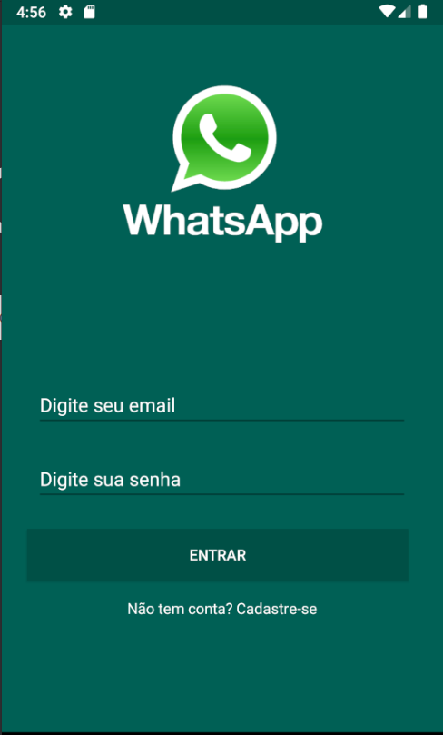
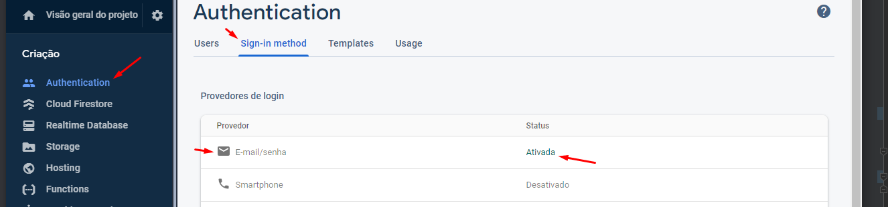
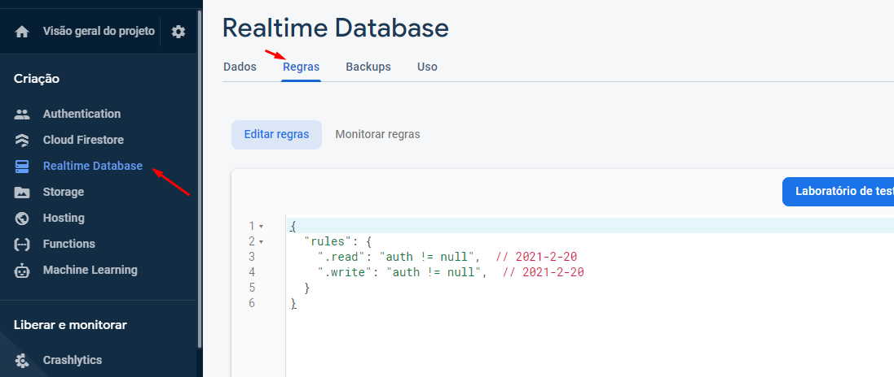
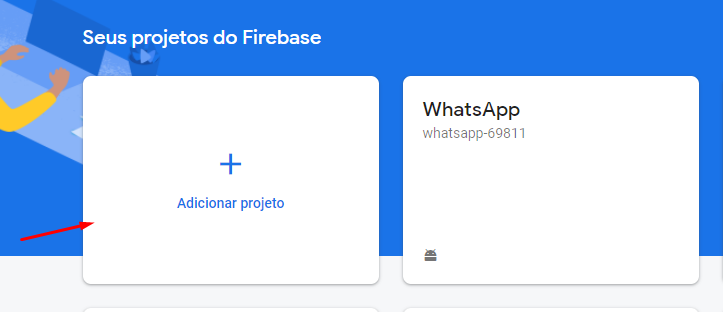
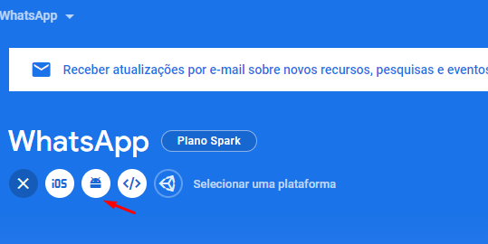
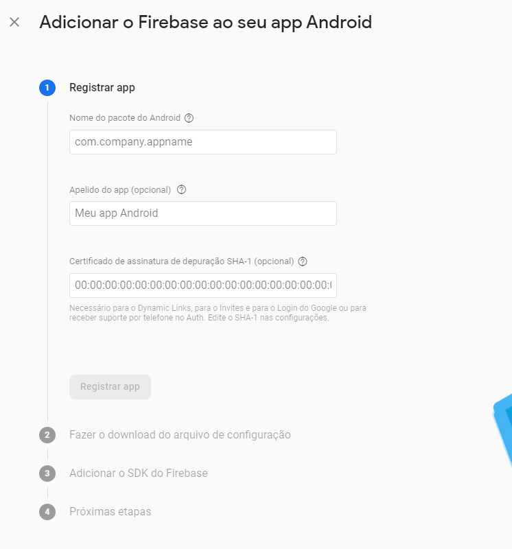
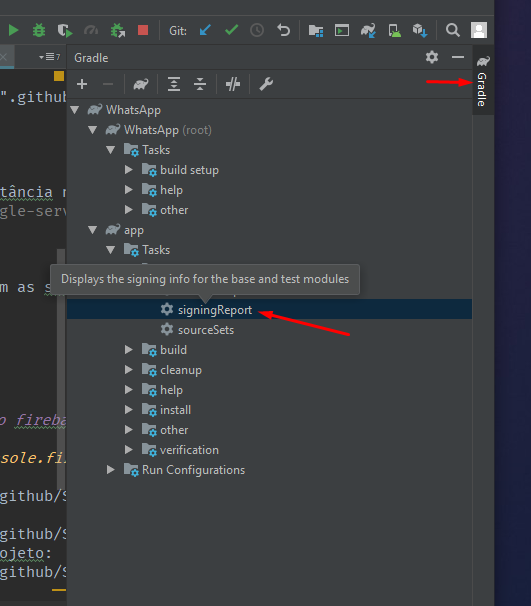

<h1 align="center">
   WhatsApp clone - Firebase e Android (Java)
</h1>

    Projeto de um simples chat de conversa privado ultilizando firebase, neste app você pode
    conversar com um contato de forma privada ultilizando a arquitetura do Realtime Database.

 
  

 

  

## 💡 Funcionalidades

- Login
- Cadastro
- Adicionar contatos
- Conversar com contato ao vivo
- Conversa privada
- Lista de conversas
- Lista de contatos

## 🏃‍ Run Project

- o projeto necessita de uma instância no firebase com autenticação e real time database configurados.
- você deve gerar o arquivo `google-services.json` antes de executar o app o mesmo deve estar presente na pasta app.

## ⚠ Config Autenticação

## ⚠ Config Realtime Database

## 🚀 Tecnologias

Esse projeto foi desenvolvido com as seguintes tecnologias:

- [Java]
- [Gradle]
- [Firebase]
- [Android]

## 💻 Como criar uma instância no firebase

- Acesse o [console](https://console.firebase.google.com/) 
- crie um novo projeto:

- crie o projeto para android:

- configure as informações do projeto:

- como gerar o SHA-1 ?

- após isso o certificado vai aparecer no seu terminal
- Em seguida é só fazer o download o `google-services.json`

## :memo: Licença

Esse projeto está sob a licença MIT. Veja o arquivo [LICENSE](LICENSE.md) para mais detalhes.

---
